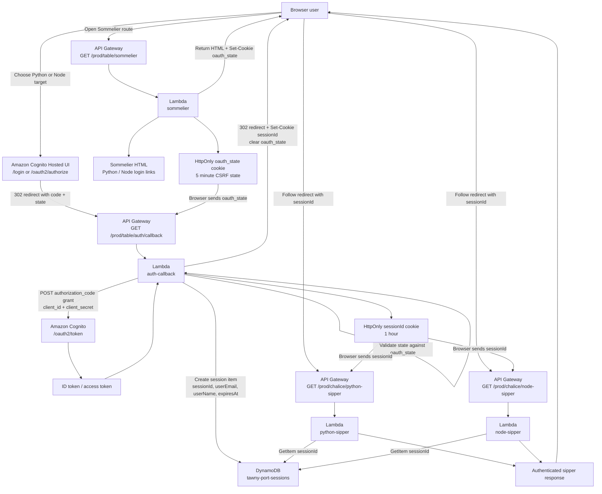
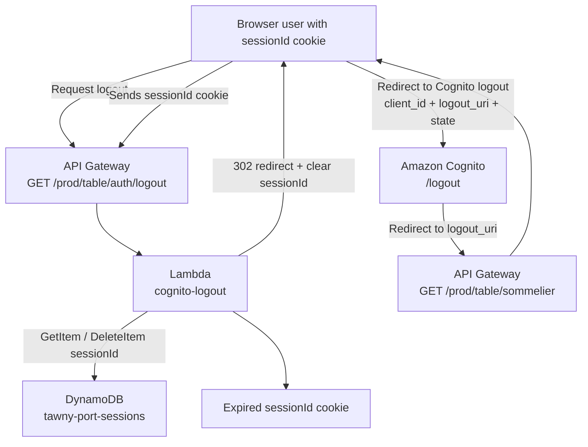
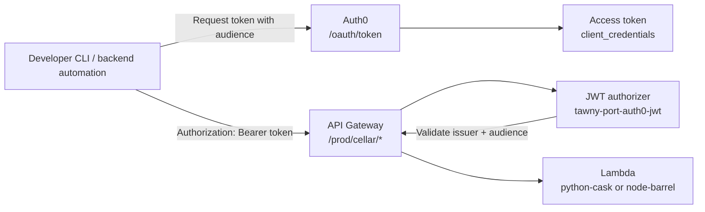

# Tawny Port API

Serverless AWS infrastructure demo with **API Gateway**, **Lambda**, **Cognito Hosted UI**, **Auth0 M2M auth**, and **DynamoDB-backed sessions**.

It separates internal API access from browser login so each route family has the right trust boundary:

* **Cellar** routes use Auth0 machine-to-machine tokens for developer and service access.
* **Table** routes handle the public Sommelier, Cognito callback, and logout path.
* **Chalice** routes use an HttpOnly `sessionId` cookie backed by DynamoDB.

```text
From the Cellar, to the Table, through the Sommelier, into the Chalice.
```

---

## Documentation

Start with the architecture below, then use the full runbook when you are ready to build the AWS resources.

| Document | Use |
| --- | --- |
| [`docs/tawny-port-api-runbook.md`](docs/tawny-port-api-runbook.md) | Full console implementation runbook from DynamoDB setup through validation |
| [`project-assets/tawny-port-brand/brand-identity.md`](project-assets/tawny-port-brand/brand-identity.md) | Apply the Cognito managed login color and type system |

## Project Assets

Console deployment source files are kept under `project-assets/`.

| Path | Purpose |
| --- | --- |
| [`project-assets/lambda-code/`](project-assets/lambda-code/) | Lambda source files for the console implementation |
| [`project-assets/tawny-port-brand/`](project-assets/tawny-port-brand/) | Cognito managed login branding assets |

## Architecture

Tawny Port is built around route families with different trust boundaries. API Gateway carries the request, Lambda owns the work, Cognito handles browser sign-in, Auth0 protects internal API access, and DynamoDB keeps the short-lived browser session state.

Shows:

* Browser login and callback flow
* Local session validation through DynamoDB
* Cognito logout behavior
* Auth0 machine-to-machine access for Cellar
* Infrastructure boundaries that should stay intact as the project grows

> [!IMPORTANT]
> Examples are sanitized. Replace deployment-specific values such as API IDs, AWS regions, Cognito domains, Auth0 tenants, account IDs, and client IDs when deploying.

### Route Domains

The route domain is part of the architecture, not just naming:

| Domain | Route pattern | Authentication model | Purpose |
| --- | --- | --- | --- |
| Cellar | `/prod/cellar/*` | Auth0 JWT authorizer on API Gateway | Internal developer and machine-to-machine API access |
| Table | `/prod/table/*` | Public API Gateway routes plus Cognito Hosted UI | Browser Sommelier, OAuth callback, logout |
| Chalice | `/prod/chalice/*` | Lambda validates `sessionId` cookie against DynamoDB | Authenticated user-facing sipper routes |

> [!WARNING]
> Keep the route domains separate when building. Auth0 belongs on Cellar routes only; Table and Chalice use the Cognito callback plus DynamoDB-backed session flow.

### Browser Authentication Flow

The browser flow starts at Table, leaves for Cognito, returns through the callback, and enters Chalice only after a DynamoDB session exists.



#### Flow Notes

* `sommelier` generates Cognito login links with `response_type=code`, `redirect_uri`, `scope`, and a composite `state` value.
* `oauth_state` is an HttpOnly CSRF cookie set before the browser leaves for Cognito.
* Cognito redirects back to `/prod/table/auth/callback` with `code` and `state`.
* `auth-callback` validates `state`, exchanges the authorization code at Cognito `/oauth2/token`, creates a DynamoDB session, and sets an HttpOnly `sessionId` cookie.
* Sipper Lambdas do not receive Cognito tokens from the browser. They authorize by reading `sessionId` and validating it against `tawny-port-sessions`.

### Logout Flow

Logout clears the local session before sending the browser through Cognito logout. That keeps the application session and the Cognito hosted session from drifting apart.



#### Logout Notes

* The logout Lambda deletes the local DynamoDB session first.
* The Lambda clears the local `sessionId` cookie.
* The browser is redirected through Cognito `/logout` with `client_id`, `logout_uri`, and `state`.
* Cognito redirects back to the Table Sommelier route.

### Cellar Machine-To-Machine Flow

Cellar does not use browser cookies or Cognito redirects. A developer or service requests an Auth0 access token and presents it directly to API Gateway.



#### Cellar Notes

* Auth0 is only used for `/prod/cellar/*`.
* API Gateway validates Auth0 JWTs with the `tawny-port-auth0-jwt` authorizer.
* Table and Chalice routes do not use the Auth0 authorizer.

### Infrastructure Boundaries

Use these boundaries as the guardrails when expanding the project.

| Boundary | Standard pattern used |
| --- | --- |
| Browser to API | API Gateway HTTP API route invokes Lambda proxy integrations |
| Browser to Cognito | Cognito Hosted UI authorization-code redirect flow |
| Callback to Cognito | Server-side confidential client token exchange at `/oauth2/token` |
| Browser session | HttpOnly `sessionId` cookie, not browser-exposed Cognito tokens |
| Session persistence | DynamoDB table with `sessionId` partition key and `expiresAt` TTL |
| Cellar authorization | API Gateway HTTP API JWT authorizer using Auth0 issuer and audience |

### Implementation Notes

* The Lambda code uses API Gateway HTTP API style events, including `event.cookies` support.
* For multiple cookies in an HTTP API response, prefer the HTTP API response `cookies` array or another supported multi-cookie mechanism. A single response headers map cannot safely represent two separate `Set-Cookie` headers with the same key.
* Keep `CLIENT_SECRET` only in `auth-callback` configuration or a managed secret store.
* Keep Cognito callback and logout routes public at API Gateway. Their protections are state validation, Cognito code exchange, cookie attributes, and DynamoDB session handling.

## Full Implementation Runbook

Use **[Tawny Port API Runbook](docs/tawny-port-api-runbook.md)** for the complete AWS Console build:

* DynamoDB session table setup
* Auth0 machine-to-machine configuration
* Cognito Hosted UI and app client setup
* Lambda creation, handlers, permissions, and environment variables
* API Gateway routes, integrations, and authorizers
* Testing, troubleshooting, and official reference links
