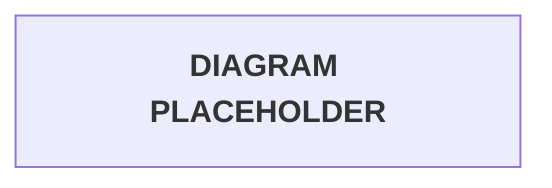

# Tawny Port API - REST Version

REST implementation of the Tawny Port serverless infrastructure demo.<br>
View the HTTPS version [here](../HTTPS/README.md) ifyou prefer that implementation.<br><br>

Tawny Port separates browser login from internal API access so each route family has the right trust boundary:

* **Cellar** routes use Auth0 machine-to-machine tokens for developer and service access.
* **Table** routes handle the public Sommelier, Cognito callback, and logout path.
* **Chalice** routes use an HttpOnly `sessionId` cookie backed by DynamoDB.

```text
From the Cellar, to the Table, through the Sommelier, into the Chalice.
```

> [!IMPORTANT]
> This folder documents the REST API implementation. Keep its invoke URL, Cognito callback URLs, Lambda environment variables, and cookie domain separate from the HTTP API implementation.

## Documentation

| Document | Use |
| --- | --- |
| [Architecture](docs/architecture.md) | Request flow, route boundaries, and REST-specific implementation notes |
| [Full Runbook](docs/tawny-port-rest-runbook.md) | Console implementation guide from AWS setup through validation |
| [Lambda Packaging](project-assets/lambda-code/README.md) | Upload and package Lambda code, including the Auth0 authorizer ZIP |
| [Shared Brand Identity](../shared/tawny-port-brand/brand-identity.md) | Cognito Managed Login color and type reference |
| [HTTPS Version](../HTTPS/README.md) | Companion HTTP API implementation |

## Project Assets

Console deployment source files for this implementation are kept under `REST/project-assets/`.

| Path | Purpose |
| --- | --- |
| [project-assets/lambda-code](project-assets/lambda-code/) | Lambda source files for the REST API implementation |
| [project-assets/lambda-code/README.md](project-assets/lambda-code/README.md) | Lambda upload and packaging guide |
| [project-assets/lambda-code/auth0-jwt-authorizer.zip](project-assets/lambda-code/auth0-jwt-authorizer.zip) | Packaged Auth0 Lambda TOKEN authorizer |
| [project-assets/lambda-code/requirements-auth0-jwt-authorizer.txt](project-assets/lambda-code/requirements-auth0-jwt-authorizer.txt) | Python dependency manifest for the Auth0 authorizer |
| [../shared/tawny-port-brand](../shared/tawny-port-brand/) | Shared Cognito Managed Login branding assets |

## Architecture Summary

The REST version uses API Gateway **REST API** resources and methods with Lambda proxy integrations. Auth0-protected Cellar routes use a Lambda TOKEN authorizer because REST APIs do not use HTTP API JWT authorizers.

| Domain | Route pattern | Authentication model | Purpose |
| --- | --- | --- | --- |
| Cellar | `/prod/cellar/*` | API Gateway REST API Lambda TOKEN authorizer | Internal developer and machine-to-machine API access |
| Table | `/prod/table/*` | Public routes plus Cognito Hosted UI | Browser Sommelier, OAuth callback, logout |
| Chalice | `/prod/chalice/*` | Lambda validates `sessionId` cookie against DynamoDB | Authenticated user-facing sipper routes |

> [!WARNING]
> Keep Auth0 authorization scoped to Cellar. Table and Chalice depend on Cognito authorization-code flow, HttpOnly cookies, and DynamoDB session validation.

## Browser Authentication Flow

The browser flow starts at Table, leaves for Cognito, returns through the callback, and enters Chalice only after a DynamoDB session exists.



Flow notes:

* `sommelier` builds Cognito Hosted UI login links with `response_type=code`, `redirect_uri`, `scope`, and a composite `state`.
* `oauth_state` is set as an HttpOnly CSRF cookie before the browser leaves for Cognito.
* Cognito redirects to `/prod/table/auth/callback` with `code` and `state`.
* `auth-callback` validates `state`, exchanges the authorization code, creates a DynamoDB session, and sets `sessionId`.
* Sipper Lambdas authorize by reading `sessionId` and validating it against `tawny-port-sessions`.

## REST API Implementation Notes

| Boundary | Standard pattern |
| --- | --- |
| Browser to API | API Gateway REST API method invokes Lambda proxy integration |
| Browser to Cognito | Cognito Hosted UI authorization-code redirect flow |
| Callback to Cognito | Server-side confidential client token exchange at `/oauth2/token` |
| Browser session | HttpOnly `sessionId` cookie, not browser-exposed Cognito tokens |
| Session persistence | DynamoDB table with `sessionId` partition key and `expiresAt` TTL |
| Cellar authorization | REST API Lambda TOKEN authorizer validates Auth0 issuer, audience, signature, and expiration |

Implementation details:

* Lambda handlers are written for REST API Lambda proxy events. Cookie reads use `headers.Cookie`, with HTTP API compatibility retained only as a fallback.
* REST responses that need more than one cookie use `multiValueHeaders` for multiple `Set-Cookie` headers.
* Cellar routes use the Lambda TOKEN authorizer named `tawny-port-auth0-jwt`.
* Table and Chalice routes do not use the Auth0 authorizer.
* `CLIENT_SECRET` belongs only in `auth-callback` configuration or a managed secret store.

## Get Started

Use the [Tawny Port - REST Runbook](docs/tawny-port-rest-runbook.md) to get started with:

* DynamoDB session table setup
* Auth0 machine-to-machine configuration
* Cognito Hosted UI and app client setup
* Lambda creation, handlers, permissions, and environment variables
* API Gateway REST API resources, methods, integrations, and authorizers
* Testing, troubleshooting, and official reference links
