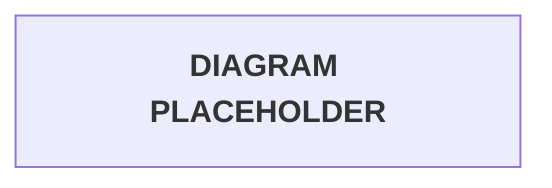

# Tawny Port Architecture

Tawny Port is a serverless AWS infrastructure demo with API Gateway, Lambda, Cognito Hosted UI, Auth0 M2M auth, and DynamoDB-backed sessions.

It is built around route families with different trust boundaries. API Gateway carries the request, Lambda owns the work, Cognito handles browser sign-in, Auth0 protects internal API access, and DynamoDB keeps the short-lived browser session state.

Use this file when you need to see how the pieces move together before changing routes, authorizers, callback URLs, or session logic.

Shows:

* Browser login and callback flow
* Local session validation through DynamoDB
* Cognito logout behavior
* Auth0 machine-to-machine access for Cellar
* Infrastructure boundaries that should stay intact as the project grows

```text
From the Cellar, to the Table, through the Sommelier, into the Chalice.
```

> [!IMPORTANT]
> Examples are sanitized. Replace deployment-specific values such as API IDs, AWS regions, Cognito domains, Auth0 tenants, account IDs, and client IDs when deploying.

---

## Route Domains

Each route domain maps to a different user type and authorization model.

| Domain | Route pattern | Authentication model | Purpose |
| --- | --- | --- | --- |
| Cellar | `/prod/cellar/*` | Auth0 Lambda TOKEN authorizer on API Gateway REST API | Internal developer and machine-to-machine API access |
| Table | `/prod/table/*` | Public API Gateway routes plus Cognito Hosted UI | Browser Sommelier, OAuth callback, logout |
| Chalice | `/prod/chalice/*` | Lambda validates `sessionId` cookie against DynamoDB | Authenticated user-facing sipper routes |

> [!WARNING]
> Keep Auth0 authorization scoped to Cellar. The Table callback and Chalice routes depend on Cognito code exchange, HttpOnly cookies, and DynamoDB session validation instead.

## Browser Authentication Flow

The browser flow starts at Table, leaves for Cognito, returns through the callback, and enters Chalice only after a DynamoDB session exists.



### Flow Notes

- `sommelier` generates Cognito login links with `response_type=code`, `redirect_uri`, `scope`, and a composite `state` value.
- `oauth_state` is an HttpOnly CSRF cookie set before the browser leaves for Cognito.
- Cognito redirects back to `/prod/table/auth/callback` with `code` and `state`.
- `auth-callback` validates `state`, exchanges the authorization code at Cognito `/oauth2/token`, creates a DynamoDB session, and sets an HttpOnly `sessionId` cookie.
- Sipper Lambdas do not receive Cognito tokens from the browser. They authorize by reading `sessionId` and validating it against `tawny-port-sessions`.

## Logout Flow

Logout clears the local session before sending the browser through Cognito logout. That keeps the application session and the Cognito hosted session from drifting apart.


### Logout Notes

- The logout Lambda deletes the local DynamoDB session first.
- The Lambda clears the local `sessionId` cookie.
- The browser is redirected through Cognito `/logout` with `client_id`, `logout_uri`, and `state`.
- Cognito redirects back to the Table Sommelier route.

## Cellar Machine-To-Machine Flow

Cellar does not use browser cookies or Cognito redirects. A developer or service requests an Auth0 access token and presents it directly to API Gateway.


### Cellar Notes

- Auth0 is only used for `/prod/cellar/*`.
- API Gateway invokes the `tawny-port-auth0-jwt` Lambda authorizer, which validates Auth0 JWTs for Cellar routes.
- Table and Chalice routes do not use the Auth0 authorizer.

## Infrastructure Boundaries

Use these boundaries as the guardrails when expanding the project.

| Boundary | Standard pattern used |
| --- | --- |
| Browser to API | API Gateway REST API method invokes Lambda proxy integrations |
| Browser to Cognito | Cognito Hosted UI authorization-code redirect flow |
| Callback to Cognito | Server-side confidential client token exchange at `/oauth2/token` |
| Browser session | HttpOnly `sessionId` cookie, not browser-exposed Cognito tokens |
| Session persistence | DynamoDB table with `sessionId` partition key and `expiresAt` TTL |
| Cellar authorization | API Gateway REST API Lambda TOKEN authorizer validates Auth0 issuer and audience |

## Implementation Notes

- The Lambda code is written for API Gateway REST API Lambda proxy events. Cookie reads use `headers.Cookie`, with HTTP API compatibility kept only as a local testing fallback.
- REST API responses that need more than one cookie use `multiValueHeaders` so API Gateway can return multiple `Set-Cookie` headers safely.
- Keep `CLIENT_SECRET` only in `auth-callback` configuration or a managed secret store.
- Keep Cognito callback and logout routes public at API Gateway. Their protections are state validation, Cognito code exchange, cookie attributes, and DynamoDB session handling.

## References

| Topic | References |
| --- | --- |
| Cellar REST API routing and Lambda proxy behavior | [API Gateway REST APIs](https://docs.aws.amazon.com/apigateway/latest/developerguide/apigateway-rest-api.html), [REST API Lambda proxy integrations](https://docs.aws.amazon.com/apigateway/latest/developerguide/set-up-lambda-proxy-integrations.html), [Invoking Lambda with API Gateway](https://docs.aws.amazon.com/lambda/latest/dg/services-apigateway.html) |
| Auth0-protected developer and machine routes | [Lambda authorizers for REST APIs](https://docs.aws.amazon.com/apigateway/latest/developerguide/apigateway-use-lambda-authorizer.html), [Configure Lambda authorizers](https://docs.aws.amazon.com/apigateway/latest/developerguide/configure-api-gateway-lambda-authorization.html), [Auth0 Client Credentials Flow](https://auth0.com/docs/get-started/authentication-and-authorization-flow/client-credentials-flow), [Auth0 APIs](https://auth0.com/docs/get-started/apis) |
| Cognito-managed browser journey | [Managed login and hosted UI](https://docs.aws.amazon.com/cognito/latest/developerguide/cognito-user-pools-hosted-ui-user-experience.html), [Managed login endpoints](https://docs.aws.amazon.com/cognito/latest/developerguide/managed-login-endpoints.html), [Authorization endpoint](https://docs.aws.amazon.com/cognito/latest/developerguide/authorization-endpoint.html), [Token endpoint](https://docs.aws.amazon.com/cognito/latest/developerguide/token-endpoint.html), [Logout endpoint](https://docs.aws.amazon.com/cognito/latest/developerguide/logout-endpoint.html) |
| Session persistence and cleanup model | [Working with DynamoDB items](https://docs.aws.amazon.com/amazondynamodb/latest/developerguide/WorkingWithItems.html), [DynamoDB Time to Live](https://docs.aws.amazon.com/amazondynamodb/latest/developerguide/TTL.html) |
