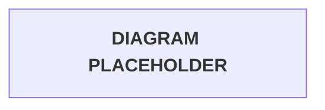

# Tawny Port API Gateway, Lambda, Cognito, Auth0, and DynamoDB Runbook

Build Tawny Port as a serverless AWS infrastructure demo with API Gateway, Lambda, Cognito Hosted UI, Auth0 M2M auth, and DynamoDB-backed sessions.

The route model keeps identity boundaries clear: Auth0 protects internal Cellar access, Cognito handles browser sign-in, Lambda owns each route handler, and DynamoDB stores short-lived application sessions.

The examples follow the real project structure while keeping deployment-specific values sanitized. Replace API IDs, account numbers, tenant IDs, hosted domains, client IDs, ARNs, and secrets only where placeholders are shown.

Provides:

* DynamoDB session table setup
* Auth0 machine-to-machine access for Cellar routes
* Cognito Hosted UI login with server-side token exchange
* Lambda route handlers for Table, Chalice, and Cellar
* API Gateway REST API resources, methods, Lambda proxy integrations, and authorizer placement
* IAM, environment variables, testing, troubleshooting, and reference links

---

## Repository References

Keep these files close while building. The Lambda source, brand assets, architecture notes, and original class notes all support the console implementation.

| Reference | Purpose |
| --- | --- |
| [`project-assets/lambda-code/`](../project-assets/lambda-code/) | Lambda source files used by the console deployment |
| [`shared/tawny-port-brand/`](../../shared/tawny-port-brand/) | Shared Cognito managed login branding assets |
| [`shared/tawny-port-brand/brand-identity.md`](../../shared/tawny-port-brand/brand-identity.md) | Tawny Port color and type quick sheet |
| [`docs/architecture.md`](./architecture.md) | Architecture diagrams and request-flow reference |
| [`docs/tawny-port-rest-runbook.md`](./tawny-port-rest-runbook.md) | Primary operational runbook |

---

## Implementation Model

Tawny Port uses route domains as trust boundaries. The stage stays environmental (`prod`), while the route domain tells you who the route is for and how it should be protected.

| Domain | Route pattern | Auth model | Purpose |
| --- | --- | --- | --- |
| Cellar | `/prod/cellar/*` | Auth0 Lambda TOKEN authorizer | Internal developer and machine-to-machine API access |
| Table | `/prod/table/*` | Public routes plus Cognito Hosted UI | Browser entry, login callback, and logout |
| Chalice | `/prod/chalice/*` | Lambda session validation against DynamoDB | Authenticated user-facing sipper routes |

> [!WARNING]
> Do not protect `/table/*` or `/chalice/*` with the Auth0 authorizer. Cellar uses Auth0 bearer tokens. Table and Chalice use the Cognito callback plus DynamoDB-backed `sessionId` cookie flow.

### Route Taxonomy

The naming is part of the architecture. Preserve this shape when rebuilding or extending the API:

```text
Tawny Port Platform
   |
   |-- Cellar  (Auth0 / developer / M2M)
   |     |-- python-cask
   |     |-- node-barrel
   |
   |-- Table   (Cognito / Sommelier / user entry)
   |     |-- sommelier
   |     |-- auth-callback
   |     |-- cognito-logout
   |
   |-- Chalice (Cognito-backed user experience)
         |-- python-sipper
         |-- node-sipper
```

Route pattern:

```text
/<stage>/<domain>/<service>
```

Current implementation:

```text
/prod/cellar/python-cask
/prod/cellar/node-barrel

/prod/table/sommelier
/prod/table/auth/callback
/prod/table/auth/logout

/prod/chalice/python-sipper
/prod/chalice/node-sipper
```

### Why This Segmentation Exists

This split keeps the system easy to reason about in the AWS Console. If a route feels misplaced, check the user type first.

| Lesson | Implementation rule |
| --- | --- |
| Stage is environment, not persona | Use `prod` as the stage and `cellar/table/chalice` as route domains |
| Auth0 M2M is ideal for developer/internal API access | Attach Auth0 only to `/cellar/*` |
| Cognito Hosted UI is ideal for browser users | Use Cognito for `/table/*` login and `/chalice/*` session-backed experiences |
| Cognito `?code=` is not a JWT | Always exchange the authorization code in `auth-callback` before entering Chalice |
| Naming architecture matters | Keep Cellar -> Table -> Chalice as the mental model |

Brand journey:

```text
From the Cellar, to the Table, through the Sommelier, into the Chalice.
```

## Sanitized Deployment Values

Start with these values before opening the AWS Console. The project names and route structure stay consistent; the identifiers come from your AWS and Auth0 deployment.

| Value | Tawny Port pattern | Replace for each deployment? |
| --- | --- | --- |
| Project slug | `tawny-port` | No, unless renaming the project |
| API stage | `prod` | Usually no |
| AWS region | `<AWS_REGION>` | Yes |
| AWS account ID | `<AWS_ACCOUNT_ID>` | Yes |
| API invoke base URL | `https://<API_ID>.execute-api.<AWS_REGION>.amazonaws.com/prod` | Yes |
| API host | `<API_ID>.execute-api.<AWS_REGION>.amazonaws.com` | Yes |
| Cognito user pool name | `tawny-port-sippers` | No, unless rebuilding under a new project name |
| Cognito user pool ID | `<COGNITO_USER_POOL_ID>` | Yes |
| Cognito hosted UI domain | `<COGNITO_DOMAIN_PREFIX>.auth.<AWS_REGION>.amazoncognito.com` | Yes |
| Cognito app client name | `port-connoisseur` | No |
| Cognito app client ID | `<COGNITO_APP_CLIENT_ID>` | Yes |
| Cognito client secret | `<COGNITO_CLIENT_SECRET>` | Yes, secret value |
| DynamoDB session table | `tawny-port-sessions` | No, unless rebuilding under a new project name |
| Auth0 API audience | `<AUTH0_AUDIENCE>` | Yes |
| Auth0 issuer | `https://<AUTH0_TENANT>.<AUTH0_REGION>.auth0.com/` | Yes |
| API Gateway Auth0 authorizer | `tawny-port-auth0-jwt` | No |

> [!CAUTION]
> Never commit real client secrets, Auth0 client secrets, AWS account IDs, full ARNs, Cognito client IDs, hosted UI domains, or execute-api URLs in public documentation.

## Architecture And Request Flow

The full request path is small on purpose: the user enters through Table, authentication happens outside the app, and Chalice only accepts a local session that Lambda can verify.



### Flow Summary

| Flow | Implementation |
| --- | --- |
| Cellar | Auth0 M2M token -> `Authorization: Bearer <TOKEN>` -> API Gateway REST API Lambda TOKEN authorizer -> Cellar Lambda |
| Login | `/table/sommelier` -> Cognito Hosted UI -> `/table/auth/callback` -> token exchange -> DynamoDB session -> `sessionId` cookie -> `/chalice/*` |
| Sipper access | Sipper Lambda reads `sessionId` cookie and validates it against `tawny-port-sessions` |
| Logout | Logout Lambda deletes the DynamoDB session, clears the cookie, and redirects through Cognito logout |

Reference links:

- [AWS API Gateway REST APIs](https://docs.aws.amazon.com/apigateway/latest/developerguide/apigateway-rest-api.html)
- [API Gateway Lambda proxy integrations for REST APIs](https://docs.aws.amazon.com/apigateway/latest/developerguide/set-up-lambda-proxy-integrations.html)
- [API Gateway Lambda authorizers for REST APIs](https://docs.aws.amazon.com/apigateway/latest/developerguide/apigateway-use-lambda-authorizer.html)
- [Amazon Cognito User Pools](https://docs.aws.amazon.com/cognito/latest/developerguide/cognito-user-identity-pools.html)

## 1. Create The DynamoDB Session Table

Create the session table first. Lambda environment variables and IAM policies refer to this table, so getting it in place early keeps the later setup clean.

1. Open **AWS Console**.
2. Go to **DynamoDB**.
3. Create a table.
4. Configure:

| Field | Value |
| --- | --- |
| Table name | `tawny-port-sessions` |
| Partition key | `sessionId` |
| Partition key type | `String` |
| Sort key | None |
| Capacity mode | On-demand |
| TTL attribute | `expiresAt` |

> [!IMPORTANT]
> Use `sessionId` exactly as the partition key. The callback, sipper, and logout Lambdas all read or write sessions by that key.

Session item shape:

```json
{
  "sessionId": "<SESSION_ID>",
  "userEmail": "user@example.com",
  "userName": "USER",
  "expiresAt": 1770000000
}
```

Keep these steady:

- Table purpose: browser session store.
- Partition key: `sessionId`.
- TTL attribute: `expiresAt`.

Replace per deployment:

- AWS region.
- AWS account ID in IAM policies.
- Optional session expiration duration in Lambda code.

### DynamoDB Session Pattern

`tawny-port-sessions` is not a user database. It is a short-lived browser session table created after Cognito authentication succeeds.

The callback Lambda writes:

```text
sessionId -> opaque random UUID stored in an HttpOnly cookie
userEmail -> extracted from Cognito ID token claims
userName  -> extracted from Cognito username or email fallback
expiresAt -> TTL epoch seconds
```

The sipper Lambdas only trust the session after a DynamoDB `GetItem` succeeds. This keeps Cognito tokens out of browser-exposed application routes and keeps the Chalice layer simple.

Reference link:

- [DynamoDB Time to Live](https://docs.aws.amazon.com/amazondynamodb/latest/developerguide/TTL.html)

## 2. Configure Auth0 For Cellar Routes

Use Auth0 only for Cellar. These routes are for developer and service access, so the flow is machine-to-machine instead of browser login.

1. Open the Auth0 dashboard.
2. Create or confirm the Tawny Port API.
3. Create or confirm the machine-to-machine application.
4. Authorize the M2M application for the Tawny Port API.

| Field | Value |
| --- | --- |
| Auth0 API name | `Tawny Port API` |
| API audience | `<AUTH0_AUDIENCE>` |
| Signing algorithm | `RS256` |
| M2M app purpose | Cellar developer/API access |

Use this authorizer configuration later in API Gateway:

| API Gateway authorizer field | Value |
| --- | --- |
| Name | `tawny-port-auth0-jwt` |
| REST API authorizer type | Lambda |
| Lambda event payload | Token |
| Lambda function | `auth0-jwt-authorizer` |
| Token source | `Authorization` |
| Token validation regex | `^Bearer [-0-9a-zA-Z._]*$` |
| Authorizer caching | `0` while testing, `300` after validation |

Keep these steady:

- Auth0 is only for `/cellar/*`.
- API Gateway expects bearer tokens in the `Authorization` header.
- The authorizer name remains `tawny-port-auth0-jwt`.
- REST API uses the `auth0-jwt-authorizer` Lambda to validate the Auth0 JWT issuer, audience, signature, and expiration.

Replace per deployment:

- Auth0 tenant.
- Auth0 issuer URL.
- Auth0 API audience.
- M2M application credentials.

### Auth0 Validation And Testing Workflow

Validate Auth0 before moving into the Cognito browser flow. This confirms the internal Cellar path works independently from Table and Chalice.

```text
Auth0 -> Cellar -> Protected Internal Validation
Cognito -> Table -> Consumer Login
Chalice -> Session/User Experience
```

Set local shell variables for the deployment:

```bash
export AUTH0_DOMAIN="https://<AUTH0_TENANT>.<AUTH0_REGION>.auth0.com"
export AUTH0_CLIENT_ID="<AUTH0_M2M_CLIENT_ID>"
export AUTH0_CLIENT_SECRET="<AUTH0_M2M_CLIENT_SECRET>"
export AUTH0_AUDIENCE="<AUTH0_AUDIENCE>"
```

Request an Auth0 access token:

```bash
curl --request POST \
  --url "$AUTH0_DOMAIN/oauth/token" \
  --header 'content-type: application/json' \
  --data '{
    "client_id":"'"$AUTH0_CLIENT_ID"'",
    "client_secret":"'"$AUTH0_CLIENT_SECRET"'",
    "audience":"'"$AUTH0_AUDIENCE"'",
    "grant_type":"client_credentials"
}'
```

If you are testing without shell variables, use the direct placeholder form:

```bash
curl --request POST \
  --url https://YOUR_AUTH0_DOMAIN/oauth/token \
  --header 'content-type: application/json' \
  --data '{
    "client_id":"YOUR_CLIENT_ID",
    "client_secret":"YOUR_CLIENT_SECRET",
    "audience":"YOUR_API_IDENTIFIER",
    "grant_type":"client_credentials"
}'
```

The response includes `access_token`, `scope`, `expires_in`, and `token_type`.

Export the token for reuse:

```bash
export AUTH0_TOKEN="PASTE_TOKEN_HERE"
```

For repeatable CLI testing, extract the token directly with `jq`:

```bash
export AUTH0_TOKEN=$(curl -s --request POST \
  --url "$AUTH0_DOMAIN/oauth/token" \
  --header 'content-type: application/json' \
  --data '{"client_id":"'"$AUTH0_CLIENT_ID"'","client_secret":"'"$AUTH0_CLIENT_SECRET"'","audience":"'"$AUTH0_AUDIENCE"'","grant_type":"client_credentials"}' \
  | jq -r '.access_token')
```

Validate that the exported value is a JWT, not raw JSON:

```bash
echo "$AUTH0_TOKEN" | head -c 20
echo "$AUTH0_TOKEN" | awk -F '.' '{print NF}'
```

Expected shape:

```text
eyJ...
3
```

> [!WARNING]
> A common failure is storing the full JSON response, such as `{"access_token":"..."}`, instead of the raw JWT. API Gateway then reports token parsing errors such as `invalid_token` or base64 decode failures. Use `jq -r '.access_token'` to extract only the token.

Test the protected Python Cellar route with the bearer token:

```bash
curl -H "Authorization: Bearer $AUTH0_TOKEN" \
"https://<API_ID>.execute-api.<AWS_REGION>.amazonaws.com/prod/cellar/python-cask?name=AuthTester"
```

Test the Node Cellar route the same way:

```bash
curl -H "Authorization: Bearer $AUTH0_TOKEN" \
"https://<API_ID>.execute-api.<AWS_REGION>.amazonaws.com/prod/cellar/node-barrel?name=AuthTester"
```

Expected result:

- API Gateway accepts the bearer token.
- The Cellar Lambda returns a successful response.
- CloudWatch logs show the Cellar Lambda invocation.

Test the protected route without a token:

```bash
curl -i "https://<API_ID>.execute-api.<AWS_REGION>.amazonaws.com/prod/cellar/python-cask"
```

Expected result:

- API Gateway returns `401` or `403`.
- The Cellar Lambda should not run for a missing or rejected token.

Common Auth0 validation failures:

| Failure | Likely cause | Fix |
| --- | --- | --- |
| Missing token | `Authorization` header is absent or empty | Send `Authorization: Bearer $AUTH0_TOKEN` |
| Invalid audience | Auth0 API identifier does not match the authorizer audience | Set `AUTH0_AUDIENCE` to the API identifier used by the API Gateway authorizer |
| Wrong issuer | Auth0 domain or trailing slash differs from the authorizer issuer | Match `https://<AUTH0_TENANT>.<AUTH0_REGION>.auth0.com/` exactly |
| Expired token | `exp` is older than the current time | Request a fresh token and re-export `AUTH0_TOKEN` |
| Incorrect scopes | API requires scopes that the M2M app was not granted | Authorize the M2M app for the API scopes, then request a new token |

### Auth0 Security Notes

- Store Auth0 secrets in a local `.env`, CI secret store, or secret manager.
- Rotate M2M client secrets.
- Use separate M2M apps for local dev, CI, and admin workflows when scopes mature.
- Do not use the Auth0 Management API audience unless the route is intentionally calling Auth0 management APIs.
- Keep Auth0 on Cellar routes only.

Reference links:

- [Auth0 Client Credentials Flow](https://auth0.com/docs/get-started/authentication-and-authorization-flow/client-credentials-flow)
- [Auth0 APIs](https://auth0.com/docs/get-started/apis)
- [API Gateway Lambda authorizers for REST APIs](https://docs.aws.amazon.com/apigateway/latest/developerguide/apigateway-use-lambda-authorizer.html)
- [jq Manual](https://jqlang.github.io/jq/manual/)

## 3. Configure Cognito For Browser Login

Cognito owns the browser sign-in step. The application only accepts the user after Cognito redirects back to the Table callback and the callback creates a local session.

The key lesson from the original build is:

```text
Cognito ?code= is an authorization code, not a JWT.
```

That code must be exchanged server-side before the user enters the Chalice experience.

### 3.1 Create Or Confirm User Pool

1. Open **Amazon Cognito**.
2. Create or open the user pool.
3. Configure:

| Field | Value |
| --- | --- |
| User pool name | `tawny-port-sippers` |
| Sign-in identifiers | Email, phone number, username |
| Self registration | Enabled |
| Required attributes | `birthday`, `email` |

### 3.2 Create Or Confirm App Client

1. In the user pool, go to **App integration**.
2. Create or open the app client.
3. Configure:

| Field | Value |
| --- | --- |
| App client name | `port-connoisseur` |
| App type | Traditional web application / confidential client |
| Client secret | Generated and stored only in Lambda configuration or Secrets Manager |
| OAuth grant | Authorization code grant |
| Scopes | `openid`, `email`, `phone` |

Use these sanitized URL patterns:

| Cognito URL field | Value |
| --- | --- |
| Allowed callback URL | `https://<API_ID>.execute-api.<AWS_REGION>.amazonaws.com/prod/table/auth/callback` |
| Allowed sign-out URL | `https://<API_ID>.execute-api.<AWS_REGION>.amazonaws.com/prod/table/sommelier` |

> [!WARNING]
> Cognito redirect and sign-out URLs must match exactly, including stage and path. A small mismatch sends users into redirect errors before Lambda code runs.

### 3.3 Configure Hosted UI Domain

Use the hosted UI domain in this shape:

```text
<COGNITO_DOMAIN_PREFIX>.auth.<AWS_REGION>.amazoncognito.com
```

The Sommelier Lambda builds Cognito login URLs with this domain:

```text
https://<COGNITO_DOMAIN>/login?client_id=<COGNITO_APP_CLIENT_ID>&response_type=code&scope=openid+email+phone&redirect_uri=<CALLBACK_REDIRECT_URI>&state=<TARGET>
```

### 3.4 Callback Flow Rationale

The Sommelier Lambda must send users to Cognito with the Table callback as the `redirect_uri`. It must not point Cognito directly at a Chalice sipper route.

Correct flow:

```text
/prod/table/sommelier
    -> Cognito Hosted UI
    -> /prod/table/auth/callback?code=<AUTHORIZATION_CODE>&state=<TARGET>:<CSRF>
    -> Cognito /oauth2/token
    -> DynamoDB session
    -> /prod/chalice/python-sipper or /prod/chalice/node-sipper
```

Why this boundary matters:

- The callback Lambda is the confidential backend component that can hold `CLIENT_SECRET`.
- The callback validates CSRF state before token exchange.
- The callback exchanges the authorization code for Cognito tokens at `/oauth2/token`.
- The callback creates the short-lived DynamoDB session.
- Chalice routes receive only an HttpOnly `sessionId` cookie, not raw Cognito tokens.

> [!IMPORTANT]
> Keep `CLIENT_SECRET` off `sommelier`, browser code, and sipper Lambdas. In this architecture, only `auth-callback` is the confidential OAuth client.

Reference links:

- [Amazon Cognito authorization endpoint](https://docs.aws.amazon.com/cognito/latest/developerguide/authorization-endpoint.html)
- [Amazon Cognito token endpoint](https://docs.aws.amazon.com/cognito/latest/developerguide/token-endpoint.html)
- [Amazon Cognito managed login and hosted UI](https://docs.aws.amazon.com/cognito/latest/developerguide/cognito-user-pools-hosted-ui-user-experience.html)
- [Amazon Cognito managed login endpoints](https://docs.aws.amazon.com/cognito/latest/developerguide/managed-login-endpoints.html)
- [Amazon Cognito User Pools](https://docs.aws.amazon.com/cognito/latest/developerguide/cognito-user-identity-pools.html)

### 3.5 Configure Managed Login Branding

Apply the Tawny Port visual system from:

- [`shared/tawny-port-brand/`](../../shared/tawny-port-brand/)
- [`shared/tawny-port-brand/brand-identity.md`](../../shared/tawny-port-brand/brand-identity.md)

> [!NOTE]
> Select the appropriate asset version that meets AWS Cognito file size requirements before uploading.

Reference link:

- [Apply branding to Amazon Cognito managed login pages](https://docs.aws.amazon.com/cognito/latest/developerguide/managed-login-branding.html)

Keep these steady:

- Cognito handles browser login.
- Callback path is `/prod/table/auth/callback`.
- Sign-out returns to `/prod/table/sommelier`.
- The app client name is `port-connoisseur`.

Replace per deployment:

- Cognito hosted domain.
- User pool ID.
- App client ID.
- App client secret.
- Full execute-api callback and logout URLs.

### Cognito Direct-Auth Study Notes

The deployed path uses Cognito Hosted UI plus the authorization-code callback. The original notes also covered Cognito API authentication flows for CLI and backend study:

| Flow | Meaning | Best use |
| --- | --- | --- |
| `USER_AUTH` | Negotiated authentication flow with `SELECT_CHALLENGE` | Modern/adaptive auth learning, SRP-capable clients |
| `USER_PASSWORD_AUTH` | Direct username/password authentication | CLI labs, backend tests, transparent troubleshooting |

`SECRET_HASH` is a derived HMAC proof made from username, app client ID, and client secret. Cognito uses it so clients do not send the raw app client secret as a request parameter.

Direct-auth documentation:

- [Amazon Cognito authentication flows](https://docs.aws.amazon.com/cognito/latest/developerguide/authentication.html)
- [Amazon Cognito authentication flow methods](https://docs.aws.amazon.com/cognito/latest/developerguide/amazon-cognito-user-pools-authentication-flow-methods.html)
- [Amazon Cognito InitiateAuth API](https://docs.aws.amazon.com/cognito-user-identity-pools/latest/APIReference/API_InitiateAuth.html)
- [AWS CLI initiate-auth](https://docs.aws.amazon.com/cli/latest/reference/cognito-idp/initiate-auth.html)
- [AWS CLI respond-to-auth-challenge](https://docs.aws.amazon.com/cli/latest/reference/cognito-idp/respond-to-auth-challenge.html)
- [AWS Cognito MFA documentation](https://docs.aws.amazon.com/cognito/latest/developerguide/user-pool-settings-mfa.html)
- [Computing secret hash values](https://docs.aws.amazon.com/cognito/latest/developerguide/signing-up-users-in-your-app.html#cognito-user-pools-computing-secret-hash)
- [AWS re:Post: unable to verify secret hash](https://repost.aws/knowledge-center/cognito-unable-to-verify-secret-hash)
- [JWT Introduction](https://jwt.io/introduction)

## 4. Create Lambda Functions

Create one Lambda per route handler using the source files in [`project-assets/lambda-code/`](../project-assets/lambda-code/). This keeps each access pattern small and easy to troubleshoot in the console.

> [!NOTE]
> See [`project-assets/lambda-code/README.md`](../project-assets/lambda-code/README.md) for the short packaging guide, including how to build the Auth0 authorizer ZIP with PyJWT.

| Lambda function | Runtime | Source file | Handler | Purpose |
| --- | --- | --- | --- | --- |
| `auth0-jwt-authorizer` | Python | [`auth0-jwt-authorizer.py`](../project-assets/lambda-code/auth0-jwt-authorizer.py) | `lambda_function.handler` or `lambda_function.lambda_handler` | REST API Lambda TOKEN authorizer for Cellar routes |
| `python-cask` | Python | [`python-cask.py`](../project-assets/lambda-code/python-cask.py) | `lambda_function.lambda_handler` or console equivalent | Cellar Python test API |
| `node-barrel` | Node.js | [`node-barrel.cjs`](../project-assets/lambda-code/node-barrel.cjs) | `index.handler` or file-name equivalent | Cellar Node test API |
| `sommelier` | Python | [`sommelier.py`](../project-assets/lambda-code/sommelier.py) | `lambda_function.lambda_handler` or console equivalent | Public Table Sommelier |
| `auth-callback` | Python | [`auth-callback.py`](../project-assets/lambda-code/auth-callback.py) | `lambda_function.lambda_handler` or console equivalent | Cognito code exchange and session creation |
| `cognito-logout` | Python | [`cognito-logout.py`](../project-assets/lambda-code/cognito-logout.py) | `lambda_function.lambda_handler` or console equivalent | Session deletion and logout redirect |
| `python-sipper` | Python | [`python-sipper.py`](../project-assets/lambda-code/python-sipper.py) | `lambda_function.lambda_handler` or console equivalent | Authenticated Python user route |
| `node-sipper` | Node.js 20.x | [`node-sipper.cjs`](../project-assets/lambda-code/node-sipper.cjs) | `index.handler` or file-name equivalent | Authenticated Node user route |

> [!IMPORTANT]
> If you paste code into the Lambda console, make sure the handler setting matches the file name shown in the console. For example, `index.handler` requires an `index.py`, `index.js`, or `index.cjs` style file depending on runtime.
> If you upload Python files as ZIP packages, use a valid Python module filename such as `lambda_function.py` or `index.py`. The repository filenames preserve project naming, but hyphenated names are not valid Python module names for Lambda handlers.
> The Auth0 authorizer exposes both `handler` and `lambda_handler`, so either handler suffix works after the code is placed in a valid Python module file.

### 4.1 Upload Lambda Code

For the plain Python and Node route handlers, the fastest console workflow is to paste the source into the Lambda code editor.

1. Open the Lambda function.
2. Go to **Code**.
3. Paste the matching source file from [`project-assets/lambda-code/`](../project-assets/lambda-code/).
4. Confirm the runtime and handler match the file in the console.
5. Click **Deploy** if prompted.

For `auth0-jwt-authorizer`, upload a ZIP package instead of pasting only the `.py` file. The function imports `jwt`, and Lambda does not include PyJWT by default.

Build the package locally:

```bash
cd REST/project-assets/lambda-code

mkdir -p auth0-authorizer-build
cp auth0-jwt-authorizer.py auth0-authorizer-build/lambda_function.py
python3 -m pip install -r requirements-auth0-jwt-authorizer.txt -t auth0-authorizer-build

cd auth0-authorizer-build
zip -r ../auth0-jwt-authorizer.zip .
```

`auth0-authorizer-build/` is a temporary local packaging directory. It does not need to be committed when `auth0-jwt-authorizer.zip` is already present. Rebuild the ZIP when dependency versions, runtime versions, or the authorizer source changes.

Upload it in the Lambda console:

1. Open `auth0-jwt-authorizer`.
2. Go to **Code**.
3. Choose **Upload from**.
4. Select **.zip file**.
5. Upload `auth0-jwt-authorizer.zip`.
6. Set the handler to `lambda_function.handler` or `lambda_function.lambda_handler`.
7. Click **Deploy** if prompted.

> [!WARNING]
> If the authorizer returns `No module named 'jwt'`, the Lambda code was pasted without PyJWT or the package/layer was not attached. Rebuild and upload the ZIP package or attach a compatible Lambda layer.
> If the authorizer returns a `cryptography` native library error, rebuild the package in an Amazon Linux-compatible environment or use a compatible Lambda layer.

### Lambda Implementation Notes

| Function | Implementation rationale |
| --- | --- |
| `auth0-jwt-authorizer` | Validates Auth0 RS256 JWTs for API Gateway REST API because REST APIs do not use HTTP API JWT authorizers |
| `python-cask` | Minimal internal Python Cellar route used to verify Auth0-protected API Gateway access |
| `node-barrel` | Minimal internal Node Cellar route used to verify the same Auth0 protection across runtimes |
| `sommelier` | Public Table landing page that builds Cognito Hosted UI links and stores `oauth_state` in an HttpOnly cookie |
| `auth-callback` | Server-side OAuth callback that validates `state`, exchanges `code`, extracts user claims, creates a DynamoDB session, and redirects to Chalice |
| `cognito-logout` | Deletes the local DynamoDB session, clears the local cookie, and redirects through Cognito logout |
| `python-sipper` | Reads `sessionId` from the REST API `Cookie` header and validates against DynamoDB |
| `node-sipper` | Mirrors Python sipper logic with AWS SDK v3 DynamoDB client |

> [!NOTE]
> REST API Lambda proxy events send browser cookies in `headers.Cookie`. The sipper and logout code keep HTTP API `event.cookies` support only as a compatibility fallback for local testing or future comparison builds.

> [!IMPORTANT]
> `auth0-jwt-authorizer.py` uses `PyJWT` with cryptography support. Package that Lambda with [`requirements-auth0-jwt-authorizer.txt`](../project-assets/lambda-code/requirements-auth0-jwt-authorizer.txt) or attach a Lambda layer that provides `PyJWT[crypto]` before using the REST API authorizer in AWS.

Reference links:

- [Invoking Lambda with API Gateway](https://docs.aws.amazon.com/lambda/latest/dg/services-apigateway.html)
- [API Gateway Lambda proxy integrations for REST APIs](https://docs.aws.amazon.com/apigateway/latest/developerguide/set-up-lambda-proxy-integrations.html)
- [API Gateway Lambda authorizers for REST APIs](https://docs.aws.amazon.com/apigateway/latest/developerguide/apigateway-use-lambda-authorizer.html)
- [Python hmac module](https://docs.python.org/3/library/hmac.html)
- [Python hashlib module](https://docs.python.org/3/library/hashlib.html)
- [Python base64 module](https://docs.python.org/3/library/base64.html)

## 5. Configure Lambda Environment Variables

Set these values after each Lambda is created. Keep secrets out of source files; the console configuration or a managed secret store should own deployment-specific values.

> [!IMPORTANT]
> Use the same `<API_ID>`, `<AWS_REGION>`, and `prod` stage consistently across Cognito URLs, Lambda environment variables, and API Gateway route tests.

### `sommelier`

| Key | Value |
| --- | --- |
| `CALLBACK_REDIRECT_URI` | `https://<API_ID>.execute-api.<AWS_REGION>.amazonaws.com/prod/table/auth/callback` |
| `CLIENT_ID` | `<COGNITO_APP_CLIENT_ID>` |
| `COGNITO_DOMAIN` | `<COGNITO_DOMAIN_PREFIX>.auth.<AWS_REGION>.amazoncognito.com` |

### `auth-callback`

| Key | Value |
| --- | --- |
| `BASE_URL` | `https://<API_ID>.execute-api.<AWS_REGION>.amazonaws.com/prod/chalice` |
| `CLIENT_ID` | `<COGNITO_APP_CLIENT_ID>` |
| `CLIENT_SECRET` | `<COGNITO_CLIENT_SECRET>` |
| `COGNITO_DOMAIN` | `<COGNITO_DOMAIN_PREFIX>.auth.<AWS_REGION>.amazoncognito.com` |
| `REDIRECT_URI` | `https://<API_ID>.execute-api.<AWS_REGION>.amazonaws.com/prod/table/auth/callback` |
| `SESSION_TABLE` | `tawny-port-sessions` |
| `COOKIE_DOMAIN` | `<API_ID>.execute-api.<AWS_REGION>.amazonaws.com` |
| `SOMMELIER_URL` | `https://<API_ID>.execute-api.<AWS_REGION>.amazonaws.com/prod/table/sommelier` |

### `cognito-logout`

| Key | Value |
| --- | --- |
| `CLIENT_ID` | `<COGNITO_APP_CLIENT_ID>` |
| `COGNITO_DOMAIN` | `<COGNITO_DOMAIN_PREFIX>.auth.<AWS_REGION>.amazoncognito.com` |
| `COOKIE_DOMAIN` | `<API_ID>.execute-api.<AWS_REGION>.amazonaws.com` |
| `POST_LOGOUT_REDIRECT_URI` | `https://<API_ID>.execute-api.<AWS_REGION>.amazonaws.com/prod/table/sommelier` |
| `SESSION_TABLE` | `tawny-port-sessions` |

### `python-sipper`

| Key | Value |
| --- | --- |
| `SESSION_TABLE` | `tawny-port-sessions` |

### `node-sipper`

| Key | Value |
| --- | --- |
| `SESSION_TABLE` | `tawny-port-sessions` |

### `python-cask` and `node-barrel`

No environment variables are required.

### `auth0-jwt-authorizer`

| Key | Value |
| --- | --- |
| `AUTH0_ISSUER` | `https://<AUTH0_TENANT>.<AUTH0_REGION>.auth0.com/` |
| `AUTH0_AUDIENCE` | `<AUTH0_AUDIENCE>` |
| `AUTH0_JWKS_URI` | `https://<AUTH0_TENANT>.<AUTH0_REGION>.auth0.com/.well-known/jwks.json` |

> [!CAUTION]
> `CLIENT_SECRET` belongs only on `auth-callback`. Do not configure it on `sommelier`, sipper functions, frontend code, or public documentation.

## 6. Configure IAM Roles

Every Lambda execution role needs CloudWatch Logs permissions. Only session-aware Lambdas need DynamoDB access.

> [!TIP]
> Start with one execution role per Lambda. It makes least-privilege permissions easier to audit because each function only receives the DynamoDB actions it actually uses.

### 6.1 CloudWatch Logs

Use this ARN pattern in Lambda logging policies:

```text
arn:aws:logs:<AWS_REGION>:<AWS_ACCOUNT_ID>:log-group:/aws/lambda/<FUNCTION_NAME>:*
```

### 6.2 DynamoDB Session Table ARN

Use this table ARN pattern:

```text
arn:aws:dynamodb:<AWS_REGION>:<AWS_ACCOUNT_ID>:table/tawny-port-sessions
```

### 6.3 DynamoDB Actions By Function

| Lambda function | DynamoDB permissions |
| --- | --- |
| `auth0-jwt-authorizer` | None |
| `auth-callback` | `dynamodb:PutItem` |
| `python-sipper` | `dynamodb:GetItem` |
| `node-sipper` | `dynamodb:GetItem` |
| `cognito-logout` | `dynamodb:GetItem`, `dynamodb:DeleteItem` |
| `sommelier` | None |
| `python-cask` | None |
| `node-barrel` | None |

Example policy for `auth-callback`:

```json
{
  "Version": "2012-10-17",
  "Statement": [
    {
      "Effect": "Allow",
      "Action": ["dynamodb:PutItem"],
      "Resource": "arn:aws:dynamodb:<AWS_REGION>:<AWS_ACCOUNT_ID>:table/tawny-port-sessions"
    }
  ]
}
```

Example policy for sipper functions:

```json
{
  "Version": "2012-10-17",
  "Statement": [
    {
      "Effect": "Allow",
      "Action": ["dynamodb:GetItem"],
      "Resource": "arn:aws:dynamodb:<AWS_REGION>:<AWS_ACCOUNT_ID>:table/tawny-port-sessions"
    }
  ]
}
```

Example policy for `cognito-logout`:

```json
{
  "Version": "2012-10-17",
  "Statement": [
    {
      "Effect": "Allow",
      "Action": [
        "dynamodb:GetItem",
        "dynamodb:DeleteItem"
      ],
      "Resource": "arn:aws:dynamodb:<AWS_REGION>:<AWS_ACCOUNT_ID>:table/tawny-port-sessions"
    }
  ]
}
```

Keep these steady:

- One Lambda role per function is preferred.
- Cellar test routes do not need DynamoDB.
- Session-aware routes receive least-privilege DynamoDB access.

Replace per deployment:

- AWS account ID.
- AWS region.
- Generated role suffixes if roles are created by the console.

## 7. Configure API Gateway

Use API Gateway REST API for this deployment. Each route is built as a resource plus an explicit method, and every Lambda integration should use Lambda proxy integration so the functions receive the REST API event shape directly.

> [!IMPORTANT]
> This REST build is intentionally separate from the earlier HTTP API build. Do not mix REST and HTTP API invoke URLs inside Cognito callback URLs, Lambda environment variables, cookie domains, or logout URLs.

### 7.1 Stage

| Field | Value |
| --- | --- |
| Stage | `prod` |
| Invoke URL pattern | `https://<API_ID>.execute-api.<AWS_REGION>.amazonaws.com/prod` |

> [!IMPORTANT]
> Route keys do not include `/prod`. The stage appears in the invoke URL only.

### 7.2 Routes And Integrations

Create these resources and methods under the REST API resource tree. For each method, choose **Lambda Function** integration and enable **Use Lambda Proxy integration**.

| Resource path | Method | Lambda integration | Authorization |
| --- | --- | --- | --- |
| `/cellar/python-cask` | GET | `python-cask` | `tawny-port-auth0-jwt` |
| `/cellar/node-barrel` | GET | `node-barrel` | `tawny-port-auth0-jwt` |
| `/table/sommelier` | GET | `sommelier` | None |
| `/table/auth/callback` | GET | `auth-callback` | None |
| `/table/auth/logout` | GET | `cognito-logout` | None |
| `/chalice/python-sipper` | GET | `python-sipper` | None at API Gateway; Lambda validates session |
| `/chalice/node-sipper` | GET | `node-sipper` | None at API Gateway; Lambda validates session |

> [!WARNING]
> If a route returns a JSON wrapper like `{"statusCode":200,"headers":...,"body":"<html>..."}`, Lambda proxy integration is not enabled for that method. Enable proxy integration, save the method, and redeploy the `prod` stage.

### 7.2.1 Method Guidance

Use `GET` for the current routes:

- Sommelier landing page
- OAuth callback
- logout redirect
- sipper pages
- simple Cellar test endpoints

Avoid `ANY` until the route truly needs multiple methods. Keeping methods explicit makes REST API authorization and troubleshooting clearer.

### 7.2.2 Auth0 Lambda Authorizer Rules

For Cellar routes, the REST API Lambda TOKEN authorizer validates issuer and audience inside `auth0-jwt-authorizer`.

| REST API authorizer field | Value |
| --- | --- |
| Authorizer name | `tawny-port-auth0-jwt` |
| Type | Lambda |
| Lambda function | `auth0-jwt-authorizer` |
| Lambda event payload | Token |
| Token source | `Authorization` |
| Token validation | `^Bearer [-0-9a-zA-Z._]*$` |
| Authorization caching | `0` during testing, `300` after validation |
| Lambda invoke role | Leave blank unless your org requires API Gateway to assume a dedicated role |

> [!WARNING]
> In the REST API console, the token source field automatically prepends `method.request.header.`. Enter only `Authorization`.

Most authorizer failures in this project come from issuer, audience, token parsing, packaging dependencies, or route binding mistakes. If `/cellar/*` fails, inspect the JWT `iss` and `aud` claims before changing Cellar Lambda code.

Attach `tawny-port-auth0-jwt` only to:

- `GET /cellar/python-cask`
- `GET /cellar/node-barrel`

Leave Table and Chalice methods with authorization set to `None`.

Reference links:

- [AWS API Gateway REST APIs](https://docs.aws.amazon.com/apigateway/latest/developerguide/apigateway-rest-api.html)
- [API Gateway Lambda proxy integrations for REST APIs](https://docs.aws.amazon.com/apigateway/latest/developerguide/set-up-lambda-proxy-integrations.html)
- [API Gateway Lambda authorizers for REST APIs](https://docs.aws.amazon.com/apigateway/latest/developerguide/apigateway-use-lambda-authorizer.html)
- [Configure API Gateway Lambda authorizers](https://docs.aws.amazon.com/apigateway/latest/developerguide/configure-api-gateway-lambda-authorization.html)

### 7.3 Lambda Invoke Permission Pattern

API Gateway usually adds invoke permissions automatically when integrations are created in the console. If you need to verify manually, use this source ARN pattern:

```text
arn:aws:execute-api:<AWS_REGION>:<AWS_ACCOUNT_ID>:<API_ID>/prod/GET/<ROUTE_PATH>
```

Correct callback source ARN shape:

```text
arn:aws:execute-api:<AWS_REGION>:<AWS_ACCOUNT_ID>:<API_ID>/prod/GET/table/auth/callback
```

Incorrect shape:

```text
arn:aws:execute-api:<AWS_REGION>:<AWS_ACCOUNT_ID>:<API_ID>/prod/GET/prod/table/auth/callback
```

## 8. Confirm Lambda Triggers

Each Lambda should show API Gateway as its trigger after the routes and integrations are created.

| Lambda function | Trigger |
| --- | --- |
| `auth0-jwt-authorizer` | API Gateway REST API authorizer invocation for `/cellar/*` |
| `python-cask` | `GET /cellar/python-cask` |
| `node-barrel` | `GET /cellar/node-barrel` |
| `sommelier` | `GET /table/sommelier` |
| `auth-callback` | `GET /table/auth/callback` |
| `cognito-logout` | `GET /table/auth/logout` |
| `python-sipper` | `GET /chalice/python-sipper` |
| `node-sipper` | `GET /chalice/node-sipper` |

No Cognito User Pool Lambda triggers are required for this build.

> [!NOTE]
> In this project, “Lambda trigger” means API Gateway invokes the Lambda integration. Cognito User Pool triggers such as pre sign-up, post confirmation, and pre token generation are not part of the current implementation.

## 9. Test The Deployment

Test the browser path first, then the protected internal path. That order verifies the session system before moving into Auth0 authorizer troubleshooting.

> [!TIP]
> Use a private browser window for negative session tests. It avoids a valid `sessionId` cookie from a previous successful login masking session-validation problems.

### 9.1 Test Table Sommelier

Open:

```text
https://<API_ID>.execute-api.<AWS_REGION>.amazonaws.com/prod/table/sommelier
```

Expected result:

- The Sommelier page loads.
- Python and Node login options route to Cognito Hosted UI.
- The Cognito login URL uses `/prod/table/auth/callback` as the callback target.

### 9.2 Test Cognito Login And Callback

1. Select a sipper option from the Table Sommelier.
2. Sign in through Cognito Hosted UI.
3. Confirm Cognito redirects to:

```text
/prod/table/auth/callback?code=<AUTHORIZATION_CODE>&state=<TARGET>
```

4. Confirm the callback redirects to one of:

```text
/prod/chalice/python-sipper
/prod/chalice/node-sipper
```

Expected result:

- A `sessionId` cookie is set.
- A matching item appears in `tawny-port-sessions`.
- The selected sipper route returns an authenticated response.

### 9.3 Test Sipper Routes Without A Session

Open a private browser window and request:

```text
https://<API_ID>.execute-api.<AWS_REGION>.amazonaws.com/prod/chalice/python-sipper
```

Expected result:

- The route rejects the request because no valid `sessionId` cookie exists.

Repeat for:

```text
https://<API_ID>.execute-api.<AWS_REGION>.amazonaws.com/prod/chalice/node-sipper
```

### 9.4 Test Logout

Open:

```text
https://<API_ID>.execute-api.<AWS_REGION>.amazonaws.com/prod/table/auth/logout
```

Expected result:

- DynamoDB session item is deleted.
- Browser cookie is cleared.
- User returns to `/prod/table/sommelier`.

Cognito logout endpoint documentation:

- [Amazon Cognito logout endpoint](https://docs.aws.amazon.com/cognito/latest/developerguide/logout-endpoint.html)

### 9.5 Test Cellar Auth0 Routes

Use the `AUTH0_TOKEN` exported in [Auth0 Validation And Testing Workflow](#auth0-validation-and-testing-workflow). This smoke test confirms the deployed Cellar routes still reject anonymous traffic and accept a valid M2M bearer token.

Call Cellar without an Auth0 token:

```bash
curl -i "https://<API_ID>.execute-api.<AWS_REGION>.amazonaws.com/prod/cellar/python-cask"
```

Expected result:

- API Gateway returns `401` or `403`.

Call Cellar with a valid Auth0 M2M token:

```bash
curl -i -H "Authorization: Bearer $AUTH0_TOKEN" \
"https://<API_ID>.execute-api.<AWS_REGION>.amazonaws.com/prod/cellar/python-cask"
```

Repeat for the Node Cellar route:

```bash
curl -i -H "Authorization: Bearer $AUTH0_TOKEN" \
"https://<API_ID>.execute-api.<AWS_REGION>.amazonaws.com/prod/cellar/node-barrel"
```

Expected result:

- API Gateway authorizer accepts the token.
- The Cellar Lambda returns a successful response.
- CloudWatch logs confirm the Cellar function was invoked.

## 10. Troubleshooting

Most failures land in one of four places: mismatched callback URLs, missing Lambda environment variables, DynamoDB permissions, or Auth0 issuer/audience mistakes.

| Symptom | Likely cause | Fix |
| --- | --- | --- |
| Cognito redirect URI mismatch | Callback URL differs between Cognito and Lambda env vars | Make `REDIRECT_URI` and Cognito allowed callback URL identical |
| `invalid_client_secret` | Wrong app client secret or missing Basic Auth during token exchange | Confirm `CLIENT_ID` and `CLIENT_SECRET` on `auth-callback` |
| Sommelier opens Cognito but callback fails | Callback Lambda missing env vars or IAM permissions | Check `auth-callback` env vars and DynamoDB `PutItem` permission |
| Login succeeds but sipper rejects user | Missing cookie, wrong cookie domain, or no DynamoDB session item | Verify `sessionId` cookie and `tawny-port-sessions` item |
| Logout returns to Sommelier but session remains | Logout role cannot delete DynamoDB item | Add `dynamodb:DeleteItem` to `cognito-logout` role |
| Cellar route returns `401` | Missing or invalid Auth0 bearer token | Check Auth0 issuer, audience, and token header |
| Cellar route accepts no token | Auth0 authorizer not attached | Attach `tawny-port-auth0-jwt` to `/cellar` routes only |
| `invalid_token` or base64 decode error | Full JSON token response was stored instead of raw JWT | Recreate `AUTH0_TOKEN` with `jq -r '.access_token'` |
| Cognito sends `?code=` to a protected route | Cognito callback was pointed at Chalice instead of Table | Use `/prod/table/auth/callback` as the app client callback URL |
| Node Lambda import error | Handler mismatch or SDK/runtime issue | Use Node.js 20.x and confirm handler file name matches Runtime settings |
| No CloudWatch logs | Missing logging permissions | Add CloudWatch Logs permissions to Lambda role |

## 11. Certification And Study Alignment

Tawny Port is also a study project. Each implementation choice maps to a real AWS, DevOps, or identity topic worth being able to explain.

| Area | What this project demonstrates |
| --- | --- |
| API Gateway | REST APIs, resource/method design, stages, Lambda authorizers, Lambda proxy integrations |
| Lambda | Runtime-specific handlers, environment variables, IAM execution roles |
| Cognito | Hosted UI, authorization-code callback, token exchange, logout redirect |
| Auth0 | M2M client credentials, API audience, bearer-token API access |
| DynamoDB | Session table, partition key lookup, TTL-based cleanup |
| Security | Persona segmentation, least privilege, HttpOnly cookies, CSRF state, secret isolation |
| DevOps | CLI token workflows, environment variables, reproducible console deployment |

Master lessons from the original documentation:

- Stage is environment, not persona.
- Cellar, Table, and Chalice are route domains with different trust boundaries.
- JWT failures are usually `iss`, `aud`, token parsing, or route-binding failures.
- Cognito authorization code flow requires a server-side token exchange.
- Auth0 M2M is ideal for developer and internal API routes.
- Naming architecture helps operators reason about access boundaries.

## 12. Reference Map


| Topic | References |
| --- | --- |
| API Gateway REST APIs | [REST APIs](https://docs.aws.amazon.com/apigateway/latest/developerguide/apigateway-rest-api.html), [Lambda proxy integrations for REST APIs](https://docs.aws.amazon.com/apigateway/latest/developerguide/set-up-lambda-proxy-integrations.html) |
| Lambda authorizers | [Lambda authorizers for REST APIs](https://docs.aws.amazon.com/apigateway/latest/developerguide/apigateway-use-lambda-authorizer.html), [Configure Lambda authorizers](https://docs.aws.amazon.com/apigateway/latest/developerguide/configure-api-gateway-lambda-authorization.html) |
| Lambda + API Gateway | [Invoking Lambda with API Gateway](https://docs.aws.amazon.com/lambda/latest/dg/services-apigateway.html) |
| Cognito Hosted UI and user pools | [Cognito User Pools](https://docs.aws.amazon.com/cognito/latest/developerguide/cognito-user-identity-pools.html), [Managed login and hosted UI](https://docs.aws.amazon.com/cognito/latest/developerguide/cognito-user-pools-hosted-ui-user-experience.html), [Managed login endpoints](https://docs.aws.amazon.com/cognito/latest/developerguide/managed-login-endpoints.html), [Authorization endpoint](https://docs.aws.amazon.com/cognito/latest/developerguide/authorization-endpoint.html) |
| Cognito OAuth token exchange | [Token endpoint](https://docs.aws.amazon.com/cognito/latest/developerguide/token-endpoint.html) |
| Cognito branding | [Apply branding to managed login pages](https://docs.aws.amazon.com/cognito/latest/developerguide/managed-login-branding.html) |
| Cognito logout | [Logout endpoint](https://docs.aws.amazon.com/cognito/latest/developerguide/logout-endpoint.html) |
| Cognito direct auth | [Authentication](https://docs.aws.amazon.com/cognito/latest/developerguide/authentication.html), [Authentication flow methods](https://docs.aws.amazon.com/cognito/latest/developerguide/amazon-cognito-user-pools-authentication-flow-methods.html), [InitiateAuth API](https://docs.aws.amazon.com/cognito-user-identity-pools/latest/APIReference/API_InitiateAuth.html), [CLI initiate-auth](https://docs.aws.amazon.com/cli/latest/reference/cognito-idp/initiate-auth.html), [CLI respond-to-auth-challenge](https://docs.aws.amazon.com/cli/latest/reference/cognito-idp/respond-to-auth-challenge.html), [MFA](https://docs.aws.amazon.com/cognito/latest/developerguide/user-pool-settings-mfa.html) |
| Secret hash and cryptography | [Computing secret hash values](https://docs.aws.amazon.com/cognito/latest/developerguide/signing-up-users-in-your-app.html#cognito-user-pools-computing-secret-hash), [AWS re:Post secret hash troubleshooting](https://repost.aws/knowledge-center/cognito-unable-to-verify-secret-hash), [Python hmac](https://docs.python.org/3/library/hmac.html), [Python hashlib](https://docs.python.org/3/library/hashlib.html), [Python base64](https://docs.python.org/3/library/base64.html), [JWT introduction](https://jwt.io/introduction) |
| Auth0 M2M | [Auth0 Client Credentials Flow](https://auth0.com/docs/get-started/authentication-and-authorization-flow/client-credentials-flow), [Auth0 APIs](https://auth0.com/docs/get-started/apis) |
| CLI parsing | [jq Manual](https://jqlang.github.io/jq/manual/) |

## 13. Final Verification Checklist

- [ ] `tawny-port-sessions` DynamoDB table exists with `sessionId` partition key.
- [ ] TTL is enabled on `expiresAt`.
- [ ] `tawny-port-sippers` user pool exists.
- [ ] `port-connoisseur` app client uses Authorization code grant.
- [ ] Cognito callback URL points to `/prod/table/auth/callback`.
- [ ] Cognito sign-out URL points to `/prod/table/sommelier`.
- [ ] `CLIENT_SECRET` is configured only on `auth-callback`.
- [ ] Lambda functions are created from `project-assets/lambda-code/`.
- [ ] `auth0-jwt-authorizer` is packaged with `PyJWT[crypto]` or a compatible Lambda layer.
- [ ] API Gateway routes match the route table in this runbook.
- [ ] Auth0 Lambda TOKEN authorizer is attached only to Cellar routes.
- [ ] Auth0 M2M token is acquired and exported as `AUTH0_TOKEN`.
- [ ] Cellar routes reject missing tokens and accept `Authorization: Bearer $AUTH0_TOKEN`.
- [ ] Table routes are public.
- [ ] Chalice routes rely on Lambda session validation.
- [ ] Browser login creates a DynamoDB session.
- [ ] Sipper routes accept a valid session and reject missing sessions.
- [ ] Logout deletes the DynamoDB session and clears the cookie.
