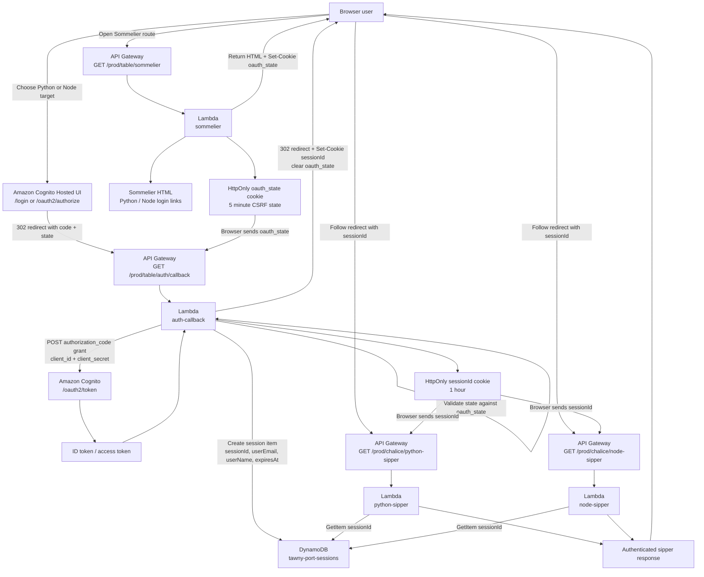
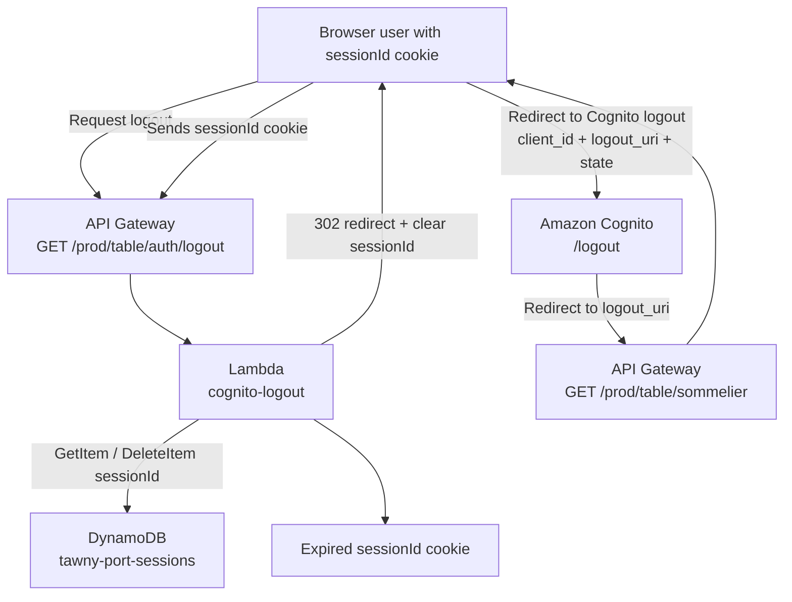
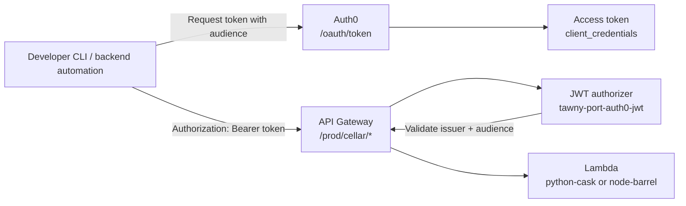
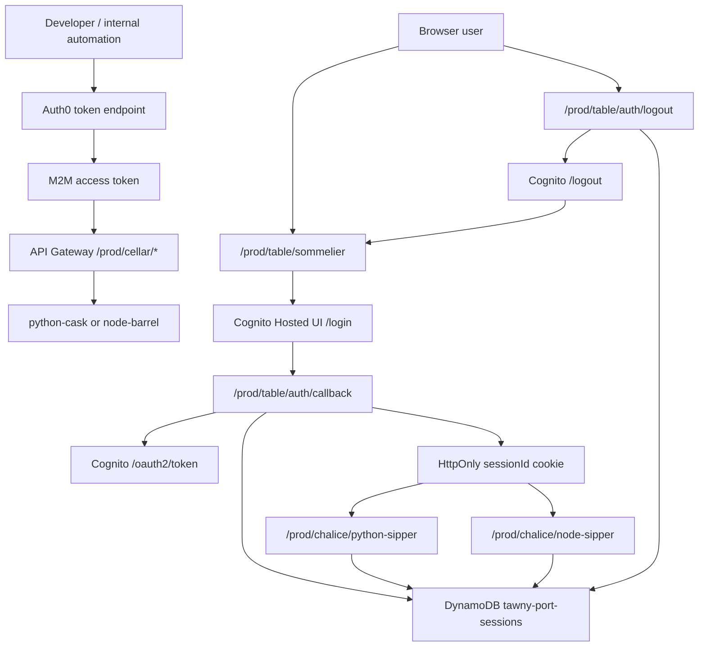

# Tawny Port Architecture Temp

Scratch space for Ttmporary architecture diagrams.

## Browser Authentication Flow

```mermaid
flowchart TD
    browser["Browser user"]
    apiSommelier["API Gateway\nGET /prod/table/sommelier"]
    sommelierLambda["Lambda\nsommelier"]
    stateCookie["HttpOnly oauth_state cookie\n5 minute CSRF state"]
    sommelierHtml["Sommelier HTML\nPython / Node login links"]

    cognitoLogin["Amazon Cognito Hosted UI\n/login or /oauth2/authorize"]
    apiCallback["API Gateway\nGET /prod/table/auth/callback"]
    callbackLambda["Lambda\nauth-callback"]
    tokenEndpoint["Amazon Cognito\n/oauth2/token"]
    tokens["ID token / access token"]
    sessions["DynamoDB\ntawny-port-sessions"]
    sessionCookie["HttpOnly sessionId cookie\n1 hour"]

    apiPython["API Gateway\nGET /prod/chalice/python-sipper"]
    pythonLambda["Lambda\npython-sipper"]
    apiNode["API Gateway\nGET /prod/chalice/node-sipper"]
    nodeLambda["Lambda\nnode-sipper"]
    appResponse["Authenticated sipper response"]

    browser -->|"Open Sommelier route"| apiSommelier
    apiSommelier --> sommelierLambda
    sommelierLambda -->|"Return HTML + Set-Cookie oauth_state"| browser
    sommelierLambda --> stateCookie
    sommelierLambda --> sommelierHtml

    browser -->|"Choose Python or Node target"| cognitoLogin
    cognitoLogin -->|"302 redirect with code + state"| apiCallback
    apiCallback --> callbackLambda
    stateCookie -->|"Browser sends oauth_state"| apiCallback
    callbackLambda -->|"Validate state against oauth_state"| callbackLambda
    callbackLambda -->|"POST authorization_code grant\nclient_id + client_secret"| tokenEndpoint
    tokenEndpoint --> tokens
    tokens --> callbackLambda
    callbackLambda -->|"Create session item\nsessionId, userEmail, userName, expiresAt"| sessions
    callbackLambda -->|"302 redirect + Set-Cookie sessionId\nclear oauth_state"| browser
    callbackLambda --> sessionCookie

    browser -->|"Follow redirect with sessionId"| apiPython
    browser -->|"Follow redirect with sessionId"| apiNode
    apiPython --> pythonLambda
    apiNode --> nodeLambda
    sessionCookie -->|"Browser sends sessionId"| apiPython
    sessionCookie -->|"Browser sends sessionId"| apiNode
    pythonLambda -->|"GetItem sessionId"| sessions
    nodeLambda -->|"GetItem sessionId"| sessions
    pythonLambda --> appResponse
    nodeLambda --> appResponse
    appResponse --> browser
```

## Logout Flow

```mermaid
flowchart TD
    browser["Browser user with sessionId cookie"]
    apiLogout["API Gateway\nGET /prod/table/auth/logout"]
    logoutLambda["Lambda\ncognito-logout"]
    sessions["DynamoDB\ntawny-port-sessions"]
    clearCookie["Expired sessionId cookie"]
    cognitoLogout["Amazon Cognito\n/logout"]
    sommelier["API Gateway\nGET /prod/table/sommelier"]

    browser -->|"Request logout"| apiLogout
    apiLogout --> logoutLambda
    browser -->|"Sends sessionId cookie"| apiLogout
    logoutLambda -->|"GetItem / DeleteItem sessionId"| sessions
    logoutLambda -->|"302 redirect + clear sessionId"| browser
    logoutLambda --> clearCookie
    browser -->|"Redirect to Cognito logout\nclient_id + logout_uri + state"| cognitoLogout
    cognitoLogout -->|"Redirect to logout_uri"| sommelier
    sommelier --> browser
```

## Cellar Machine-To-Machine Flow

```mermaid
flowchart LR
    client["Developer CLI / backend automation"]
    auth0["Auth0\n/oauth/token"]
    token["Access token\nclient_credentials"]
    apiCellar["API Gateway\n/prod/cellar/*"]
    jwtAuth["JWT authorizer\ntawny-port-auth0-jwt"]
    cellarLambda["Lambda\npython-cask or node-barrel"]

    client -->|"Request token with audience"| auth0
    auth0 --> token
    client -->|"Authorization: Bearer token"| apiCellar
    apiCellar --> jwtAuth
    jwtAuth -->|"Validate issuer + audience"| apiCellar
    apiCellar --> cellarLambda
```

## Combined Request Flow

```mermaid
flowchart TD
    dev["Developer / internal automation"] --> auth0["Auth0 token endpoint"]
    auth0 --> m2mToken["M2M access token"]
    m2mToken --> cellarRoute["API Gateway /prod/cellar/*"]
    cellarRoute --> cellarLambda["python-cask or node-barrel"]

    browser["Browser user"] --> sommelier["/prod/table/sommelier"]
    sommelier --> cognitoLogin["Cognito Hosted UI /login"]
    cognitoLogin --> callback["/prod/table/auth/callback"]
    callback --> tokenExchange["Cognito /oauth2/token"]
    callback --> sessions["DynamoDB tawny-port-sessions"]
    callback --> cookie["HttpOnly sessionId cookie"]
    cookie --> pythonSipper["/prod/chalice/python-sipper"]
    cookie --> nodeSipper["/prod/chalice/node-sipper"]
    pythonSipper --> sessions
    nodeSipper --> sessions

    browser --> logout["/prod/table/auth/logout"]
    logout --> sessions
    logout --> cognitoLogout["Cognito /logout"]
    cognitoLogout --> sommelier
```
